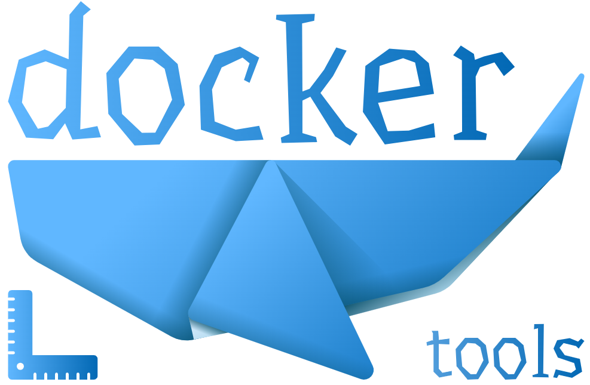

# Docker tools

<p align="center">
    
</p>

Useful aliases and scripts for docker which simplify routine operations.

## Installation

To install the project execute the following command, which will fetch the repo to your home directory and update `.bashrc` file (see [setup.sh](setup.sh)):

```sh
curl -Ls https://cutt.ly/setup-docker-tools | bash
```

Then to apply changes in your current terminal, re-import `.bashrc` contents:

```sh
. ~/.bashrc
```

## Usage

### Structure

The first two letters in every alias are always `dr` which is short for `docker`. The next one or two letters correspond to the action to perform. The mapping is following:

| Letter | Action name | Action name in the standard `docker` tool |
| --- | --- | --- |
| b | build | build |
| d | delete | remove |
| r | run | run |
| s | stop | stop |
| u | up | start |
| v | view | inspect |

The remaining letters correspond to the action parameters (see [aliases.sh](aliases.sh) for more details).

### Examples

There are several aliases confugured in the `aliases.sh`, one of which allows to get ip address of a container by checking its image repo tags, so it's very easy to apply this command for sending an http request to container:

```sh
curl $(drvis ku):8081
```

Here `drvis` stands for **d**ocke**r** **v**iew **i**p addresses of containers using image repo tag **s**ubstring.  
Another command allows to stop all docker containers by filtering their images:

```sh
drss foo
```

This command is short for "**d**ocke**r** **s**top using image repo tag **s**ubstring", and it will stop any container which uses an image, having substring 'foo' in any of its repo tags.
